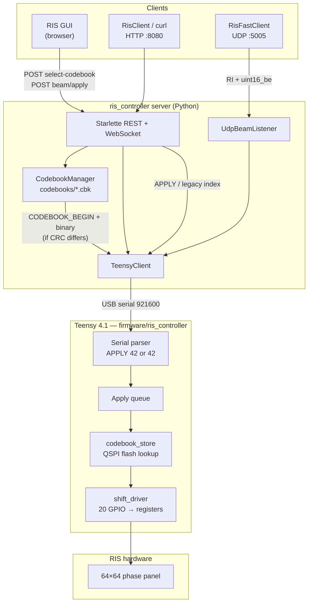
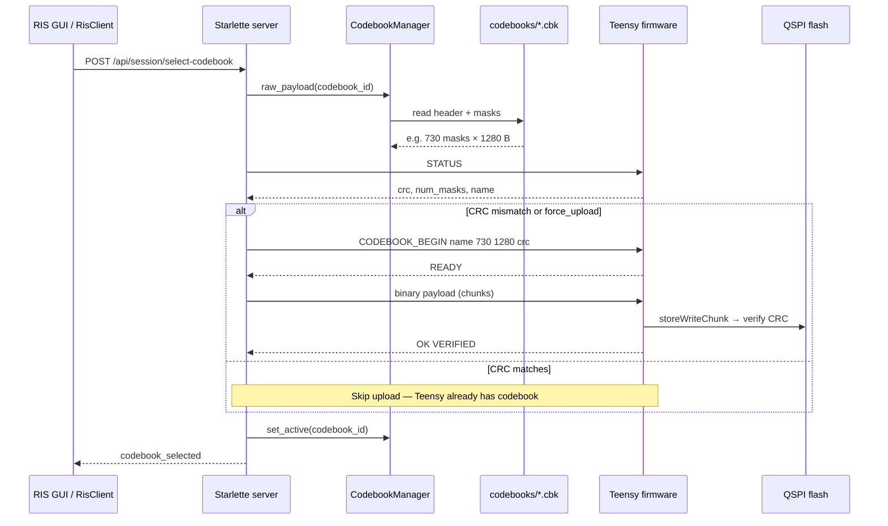
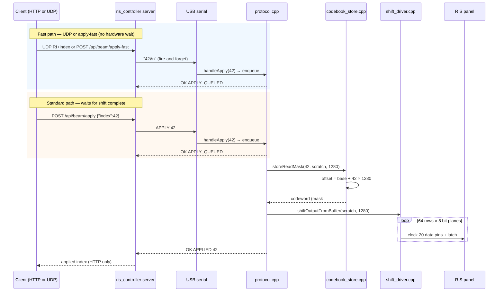
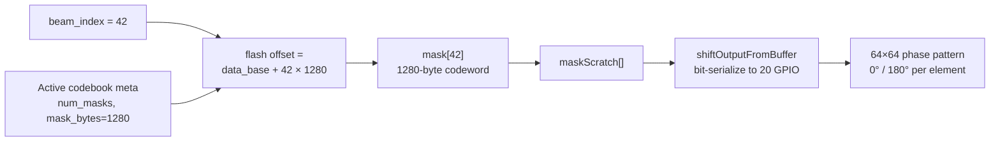

# Beam control flow (ris_controller)

This document describes how a **beam index** becomes a **RIS phase configuration** in the full `ris_controller` stack. The server owns codebooks; the Teensy stores one active codebook and looks up codewords at runtime.

**Related project:** **RIS TCP Controller** (`ris_server.py`) is a thin TCP proxy for near-RT RIC xApps — see its `docs/beam_control_flow.md`.

---

## How this stack differs from RIS TCP Controller

| | **ris_controller** (this repo) | **RIS TCP Controller** |
|---|--------------------------------|------------------------|
| Entry | HTTP :8080, WebSocket, UDP :5005 | TCP :9999 (`RIS42`) |
| Codebooks | Server library `.cbk`, upload to Teensy | None — assumes Teensy already loaded |
| GUI | Web UI, 64×64 phase maps | None |
| Serial | `APPLY 42` or `42\n`, 921600 baud | `42\n` only, 115200 default |
| Camera | — | Optional ZED `CAP` command |

Both talk to the **same Teensy firmware** (`firmware/ris_controller/`) for codeword lookup and shift-register output.

---

## 1. System overview

Source: [`diagrams/overview.mmd`](diagrams/overview.mmd)



---

## 2. Codebook setup (one-time per session)

Before real-time beam switching, the active `.cbk` must be on the Teensy. The server compares CRC via `STATUS` and uploads only when needed.

Source: [`diagrams/codebook_setup.mmd`](diagrams/codebook_setup.mmd)



---

## 3. Runtime: index → codeword → RIS

Source: [`diagrams/runtime_sequence.mmd`](diagrams/runtime_sequence.mmd)



### Latency tiers

| Path | Typical latency | Waits for hardware shift? |
|------|-----------------|---------------------------|
| `POST /api/beam/apply` | 2–20 ms | Yes (~30 ms) |
| `POST /api/beam/apply-fast` | 0.3–2 ms | No |
| UDP `RI` + uint16 → :5005 | 50–500 µs (localhost) | No |

Hardware programming remains **~25–50 ms** regardless of API.

---

## 4. Codeword lookup on Teensy

Source: [`diagrams/codeword_lookup.mmd`](diagrams/codeword_lookup.mmd)



| Concept | Detail |
|---------|--------|
| **Beam index** | Integer 0 … N−1 (e.g. 729 usable + dummy at 0) |
| **Codeword** | `mask[index]` — 1280-byte bit-packed phase map |
| **Storage** | QSPI flash on Teensy 4.1 (`codebook_store.cpp`) |
| **Apply** | `shift_driver.cpp` clocks bits into motherboard shift registers |

---

## Exporting diagrams for papers / PDFs

Diagram sources live in [`docs/diagrams/`](diagrams/) as `.mmd` files.

```bash
./scripts/export_diagrams.sh
```

The script picks the first available backend:

| Backend | Requires |
|---------|----------|
| **kroki.io** (fallback) | `curl` + network — **no npm needed** |
| `mmdc` | `npm install -g @mermaid-js/mermaid-cli` |
| `npx` | [Node.js](https://nodejs.org) (includes npm) |
| Docker | `docker pull ghcr.io/mermaid-js/mermaid-cli/mermaid-cli` |

- **SVG** — best for LaTeX, Word (if supported), high-quality PDF
- **PNG** — slides, Confluence

**No npm?** Just run `./scripts/export_diagrams.sh` — it uses [kroki.io](https://kroki.io) automatically.

**One-off (manual):** paste a `.mmd` file into [mermaid.live](https://mermaid.live) → Export SVG/PNG.

GitHub renders the Mermaid blocks in this file directly; committed `.svg` files are optional for offline readers.
